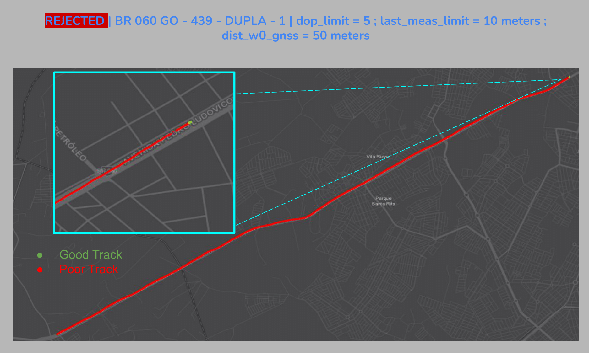

<div align = "center";>

# GoPro DataFlow
  <!-- <a align="center" href="https://gitlab.com/computer-vision-msc/mmpdd" target="_blank">
  
  </a> --> 
</div>

_GoPro DataFlow is a Python library for extracting frames and sensor information from GoPro MP4 videos. Additionally, this library verifies corrupt measurements and provides functions to handle these issues._

## Table of contents

- [GoPro DataFlow](#gopro-dataflow)
  - [Table of contents](#table-of-contents)
- [Documentation](#documentation)
- [TODO Priority List](#todo-priority-list)
- [TODO General Task List](#todo-general-task-list)
- [Install](#install)
  - [Arguments](#arguments)
  - [Extract Sample](#extract-sample)
- [Running as module](#running-as-module)
  - [Sample](#sample)
  - [Analyses](#analyses)
    - [Analyse 1](#analyse-1)
    - [Analyse 2](#analyse-2)
    - [Analyse 3](#analyse-3)
    - [Analyse 4](#analyse-4)
    - [Analyse 5](#analyse-5)
 

# Documentation
Run documentation as server:
```sh
mkdocs serve
```

Build documentation:
```sh
mkdocs build
```

For full documentation visit [mkdocs.org](https://www.mkdocs.org).

# TODO Priority List
1. [x] :white_check_mark: [BUG 1](https://equipenet-srv.labtrans.ufsc.br/cv/gdflow/-/issues/2) | ~~**Check 8-Minute Videos That Take a Long Time to Process**~~

1. [x] :white_check_mark: [Issue 3](https://equipenet-srv.labtrans.ufsc.br/cv/gdflow/-/issues/3) | ~~**Implement a method to filter out videos with a low utilization percentage**: As demonstrated in   [Analyse 1](#analyse-1)~~

1. [x] :white_check_mark: [Issue 4](https://equipenet-srv.labtrans.ufsc.br/cv/gdflow/-/issues/4) | ~~**Refine the export2Csv method**~~

1. [x] :white_check_mark: [Issue 6](https://equipenet-srv.labtrans.ufsc.br/cv/gdflow/-/issues/6) | ~~**Create cross-validation between imprecise GNSS measurements and ground truth locations**~~


1. [x] :white_check_mark: [Issue 5](https://equipenet-srv.labtrans.ufsc.br/cv/gdflow/-/issues/5) | ~~**Change dict return from interpDataBy(data.py)**~~
1. [x] :white_check_mark: **_Readme.md update_** | ~~**Document how to initialize mkdocs**~~


1. [x] :white_check_mark:  [Issue 9 ](https://equipenet-srv.labtrans.ufsc.br/cv/gopro-dataflow/-/issues/9) | ~~**Rename data.py to core.py**~~

1. [x] :white_check_mark: [Issue 13](https://equipenet-srv.labtrans.ufsc.br/cv/gopro-dataflow/-/issues/13) | **Adjust return verifyQualityPercentage**

1. [ ] ⏸️ [Issue 8](https://equipenet-srv.labtrans.ufsc.br/cv/gdflow/-/issues/8) | **Solve Fiona warnings**

1. [ ] ⏸️ [Issue 12 ](https://equipenet-srv.labtrans.ufsc.br/cv/gopro-dataflow/-/issues/12) | **Check why the repository is weight more than 4GB**

1. [ ] :hourglass: [Issue 14](https://equipenet-srv.labtrans.ufsc.br/cv/gopro_dataflow/-/issues/14) | **Updates on init.py to import gopro_dataflor direcly and solves conflicts on _.utils_**


1. [ ] :hourglass: [main](https://equipenet-srv.labtrans.ufsc.br/cv/gopro_dataflow) | **Export analyses as map, similar to [Analyse/Samples](#Analyse) (requires creating a map using GeoPandas and Folium)**

1. [ ] [Issue 1](https://equipenet-srv.labtrans.ufsc.br/cv/gdflow/-/issues/1) | **Reconstruct artificially videos(with .csv), using SNV, with gaps greather than limit**: Depends on  [Issue 6](https://equipenet-srv.labtrans.ufsc.br/cv/gopro/-/issues/6)

# TODO General Task List
- [ ] Transform GNSS to XYZ geodetic to interpolate at cam frquency
- [ ] Interpolate data at cam frequency, this methods may 'uncorrupt' some videos
- [ ] Implement GPP9 if available \ > hero10 (more precision)
- [ ] Adjust geom2gdf() to export shp Z
- [ ] Move initLogger() to general.py
- [ ] Move _findClosestTsmp( ) to time.py, but need to rewrite
- [ ] Move _getStartTsmp() to time.py, but need to rewrite
- [ ] Move _disableWarnings() to general.py, but need to test idk if it works importing from another file
- [ ] Move _adjustFrameIdx() to frame.py, but need to rewrite to return value
- [ ] Extract more information, such as 'STNM' and 'UNIT'
- [ ] Fetch all window of IMU measures  consider opt imu-meas
- [ ] Add imu-meas as choices ['istant','window']
- [ ] Rewrite imu-instant mode (default), takes long time  
- [ ] Transform _gpmfGnssDataKey into a lambda function based on hero model (HERO5,HERO6,...HERO11) 'GPS5' if model < '11' else 'GPS9
- [ ] Reorganize method relate to byte, stream or gpmf present in core.py 

# Install


Create env

`conda create -n gdflow python=3.9.18`

Install requirements with PIP

`(gdflow) pip install -r requirements.txt`

To run this module by itself, it is necessary to provide the path to the video from which to extract the data.

## Arguments
```sh
-h, --help            show this help message and exit
-v VIDEO, --video VIDEO
                        path to video

Optional arguments:
  -o --output                 path to output (default: --video dir name)
  --imu                 flag to export imu measures (default: False)
  --sens-freq {GNSS,CAM,IMU}
                        Frequency of sensor measurements to output. Choose from: GNSS, CAM, IMU. (default: GNSS)
  --dop-limit DOP_LIMIT
                        Discard GNSS measurements with Dilution of Precision (DOP) greater than this limit. (default: 5)
  --last-meas-limit LAST_MEAS_LIMIT
                        Consider GNSS measurement as outlier if it is more than this distance apart from last measure. (default: 10 meters)
  --dist-w0-gnss DIST_W0_GNSS
                        Limit distance in meters, after GNSS interpolating, to aceptc GNSS failures along video. DOP limit influences on failures length. (default: 50 meters)   
```  
## Extract Sample

`python core.py -v "../example_folder/video.MP4"`

After completing the data extraction, a CSV file (../example_folder/video.csv) will be generated containing all the data extracted from the video such as table bellow.

| lat         | lng         | alt    | speed2D | ... |
|------------|------------|--------|---------|---------|
| -27.6740043 | -48.7696718 | 15.676 | 10.866  |... |
| -27.6740009 | -48.7696765 | 15.684 | 10.859  |... |
| -27.6739976 | -48.7696812 | 15.699 | 10.833  |... |
| -27.6739943 | -48.7696859 | 15.695 | 10.830  |... |
| -27.673991  | -48.7696906 | 15.695 | 10.774  |... |
| -27.6739877 | -48.7696953 | 15.693 | 10.729  |... |
| -27.6739844 | -48.7697000 | 15.707 | 10.789  |... |


# Running as module

## Sample

```py
from gopro_dataflow import gopro_dataflow as gdflow

# Discard GNSS measurements with Dilution of Precision (DOP) greater than this limit.
dop_limit = 5 
# Consider GNSS measurement as outlier if it is more than this distance apart from last measure in meters.
last_meas_limit = 10 
# Limit distance in meters, after GNSS interpolating, to aceptc GNSS failures along video. DOP limit influences on failures length.
dist_w0_gnss = 50 

videos = gdflow.listVideos("../example_folder/")    
    for v in videos:
        print(f"Processing {v['videoName']}")

        raw_data, outliers = gdflow.raw_extract(v['path'],last_meas_limit})   

        """NOTE: NEW FEATURE 05/11/2023"""
        #filter gnss data by location see utils.geometry.cross_validation()         
        raw_data, gnss_outliers = filter_gnns_by(raw_data,'location')
        """!!!-------------------!!!"""

        # interpolate data to use in other apps such as icm/935
        data = gdflow.interpDataBy(raw_data,'GNSS'}) 
        
        #The 'data' is ready for use on ICM/935 

        #verify gaps after removed imprecise gnss measure and return 
        # if video should be accept (True) or reject (False) based on 
        verified1 = gdflow.verifyGnssGaps(data,dist_w0_gnss, _raise = False) 
        # to use `_raise = True` verify gopro.utils.excepetions.GnssGapExceedsLimit()
        #Verify if the video is of good quality based on a percentage threshold
        verified2 = gdflow.verifyQualityPercentage(data,_outliers,percentage_limit = 20, _raise = False)  

        #save data as csv if you need
        gdflow.data2csv(data, 
                 os.path.join(opt['output'],
                              f"{v['videoName']}.csv"))
        #save data and outliers as shapefile if you need
        gdflow.points2gdf(data2Points(data),
                   data, 
                   os.path.join(opt['output'],
                              f"{v['videoName']}.shp"))
        
        gdflow.points2gdf(data2Points(_outliers),
                   outliers, 
                   os.path.join(opt['output'],
                              f"out_{v['videoName']}.shp"))

        gdflow.points2gdf(data2Points(_outliers),
                   gnss_outliers, 
                   os.path.join(opt['output'],
                              f"gnss_out_{v['videoName']}.shp"))

```

## Analyses

Utilize the exported shapes in the [Sample](#sample) to analyze the extraction process, refine your parameters more effectively, and generate images as shown in the samples below.

Note that good tracked measures may be outliers, in this case `dist_w0_gnss` is responsable to reject all samples bellow

### Analyse 1

This sample was manually rejected because a low percentage of the video was accepted , check [TODO list](#todo-list) for more details.

<details><summary>BR 060/439 - GO with default args</summary>

</details>

### Analyse 2

<details><summary>BR 174 - RO</summary>

</details>

### Analyse 3

<details><summary>GNSS Issues (x64 video) in Natal, RN</summary>

</details>

### Analyse 4

<details><summary>GNSS Issues (x32 video) in Natal, RN</summary>

</details>


### Analyse 5
<details><summary>GNSS Issues (x32 video) in Natal, RN</summary>

 </details>

<!-- ## Acknowledgment 
<div align = "center";>
<a align="center" href="http://www.utfpr.edu.br/cursos/coordenacoes/stricto-sensu/ppgca-ct/ppgmodelo" target="_blank">
  
  </a>
  <a align="center" href="https://www.labtrans.ufsc.br/" target="_blank">
  
  </a>
</div> -->


